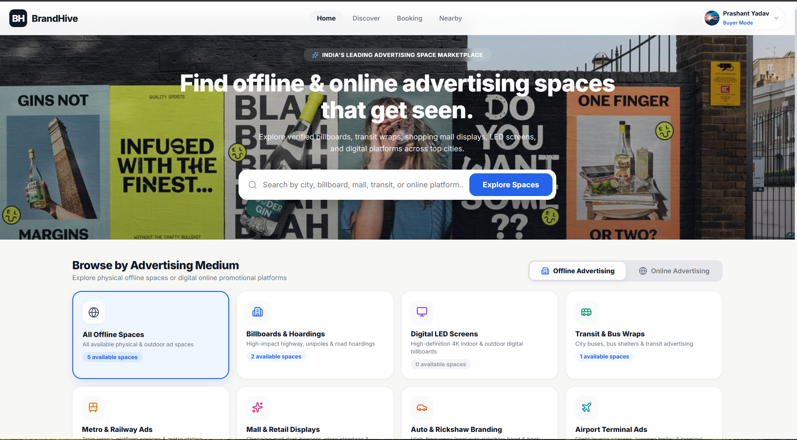
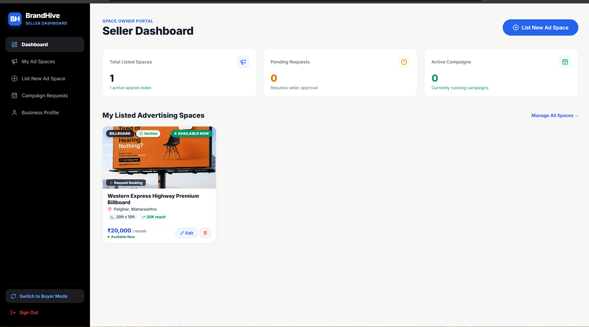
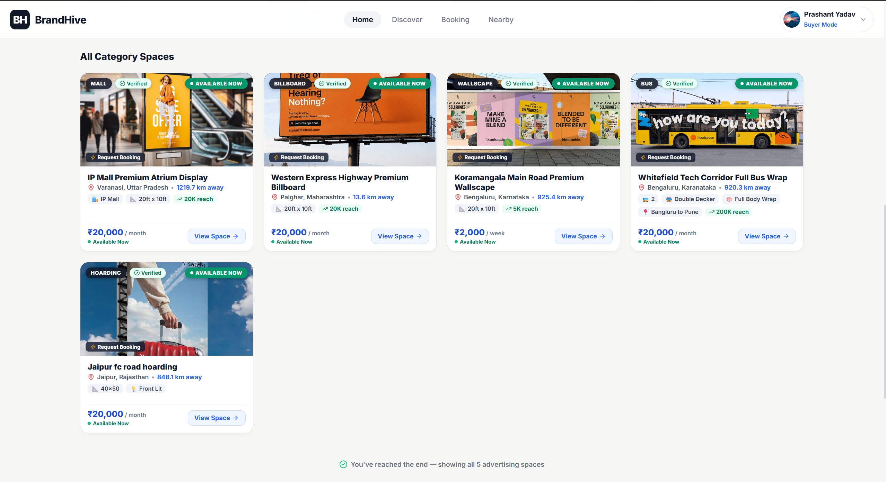
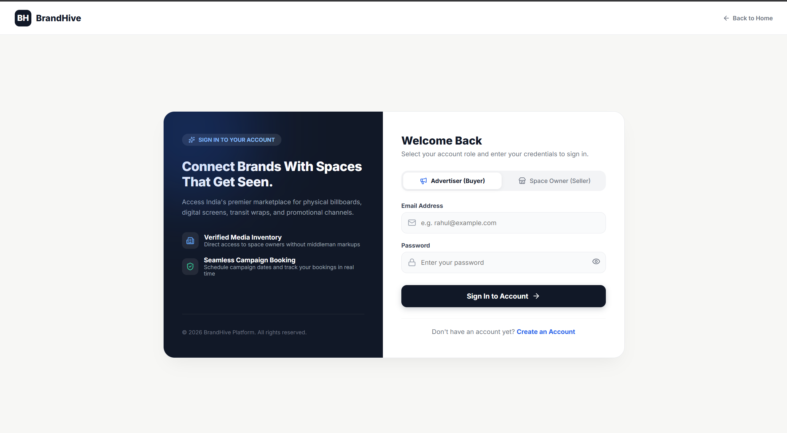
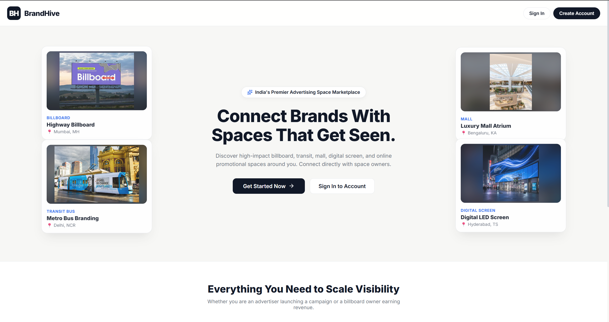
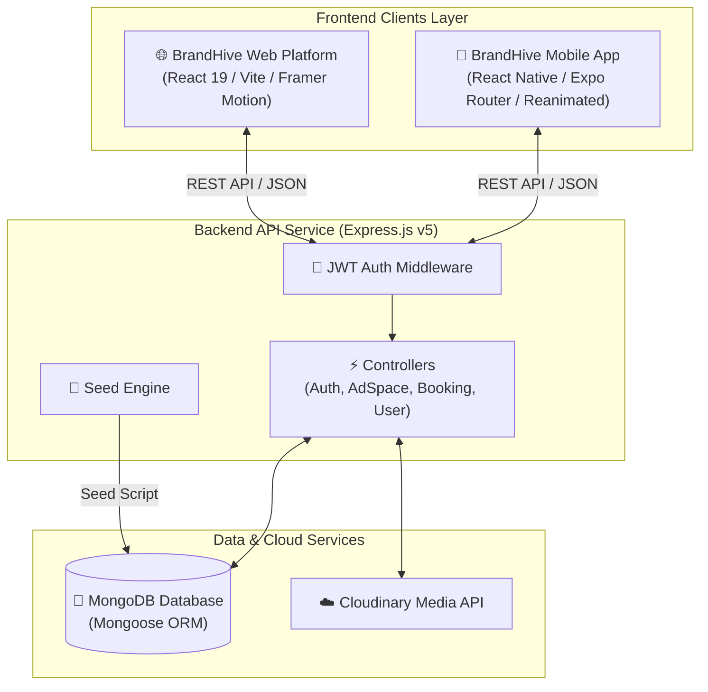

<div align="center">

  <h1>🐝 BrandHive</h1>
  <p><b>The Next-Generation Advertising Marketplace</b></p>
  <p><i>Connecting Advertisers with Ad-Space Owners for Seamless Online & Offline Media Campaigns</i></p>

  <p>
    <a href="#-demo-video"></a>
    <a href="#-screenshots--ui-showcase"></a>
    <a href="https://reactnative.dev/"></a>
    <a href="https://expo.dev/"></a>
    <a href="https://nodejs.org/"></a>
    <a href="https://expressjs.com/"></a>
    <a href="https://www.mongodb.com/"></a>
    <a href="https://vitejs.dev/"></a>
  </p>

  ---
</div>

## 📌 Overview

**BrandHive** is a full-stack cross-platform advertising marketplace engineered to streamline how businesses discover, evaluate, and book advertising inventory. Whether you're an advertiser searching for prime physical billboards, high-footfall mall displays, transit media, or targeted digital ad slots, BrandHive bridges the gap between **Advertisers (Buyers)** and **Media Owners (Sellers)**.

Featuring a dual-role architecture, users can effortlessly manage ad listings as space owners or curate targeted campaigns as advertisers within a single unified platform.

---

## 🎬 Demo Video

Experience the mobile application walkthrough showcasing ad discovery, role switching, listing creation, and real-time navigation.

<div align="center">

| 📹 **Watch Full App Walkthrough** |
| :---: |
| <video src="./ScreenShots/Video/Demo_App_Video.mp4" controls width="800" poster="./ScreenShots/Buyer_Home.png">Your browser does not support the video tag.</video> |
| 🎬 <b><a href="./ScreenShots/Video/Demo_App_Video.mp4">Click here to download or open the full Demo Video (Demo_App_Video.mp4) directly</a></b> |

</div>

---

## 🖼️ Screenshots & UI Showcase

### 📱 Mobile Application Overview

| 🏠 **Buyer Discovery Home** | 📊 **Seller Management Dashboard** |
| :---: | :---: |
|  |  |
| *Browse categories, physical & digital inventory, location filters* | *Track active listings, monitor bookings, manage earnings* |

| 📢 **Ad Space Listing Details** | 🔐 **Authentication & Security** |
| :---: | :---: |
|  |  |
| *Detailed ad specs, dimensions, pricing, and owner profiles* | *Secure JWT authentication with refresh token rotation* |

---

### 🌐 Web Platform Preview

<div align="center">

| 💻 **BrandHive Web Platform Welcome Landing** |
| :---: |
|  |
| *Modern, high-performance web dashboard built with React 19, Framer Motion, and Vite* |

</div>

---

## ✨ Core Features

* 🔐 **JWT Authentication & Security**: Secure Access and Refresh Tokens stored safely in `expo-secure-store` (Mobile) and HTTP-only cookies/headers with `bcrypt` password encryption.
* 🔄 **Dual Multi-Role Accounts**: Instant seamlessly role-switching between **Buyer Mode** (Advertiser) and **Seller Mode** (Space Owner) without logging out.
* 🏙️ **Offline Advertising Inventory**: Explore physical ad spaces including billboards, hoardings, transit (buses & auto-rickshaws), airport lounges, and shopping mall screens.
* 🌐 **Online & Digital Advertising**: List and book digital ad banners, influencer placements, social media campaigns, and web spots.
* 📍 **Location-Based Discovery**: Interactive geographic searching and location-tailored ad space recommendations.
* 📅 **Booking & Campaign Management**: Seamless booking workflows linking buyers directly to ad space listings with status tracking (`pending`, `confirmed`, `active`, `completed`).
* ☁️ **Cloudinary Image Hosting**: Instant cloud media processing for high-resolution ad space photography and user profiles.
* ⚡ **Automated Database Seeding**: Single-command seeding (`npm run seed`) populating 19 realistic accounts, 75 ad spaces, and 25 active/pending bookings.

---

## 🏗️ Architecture & Technical Stack



### 🛠️ Tech Stack Details

| Layer | Technologies & Frameworks |
| :--- | :--- |
| **Mobile App (`BrandHive/`)** | React Native `0.86`, Expo `57`, Expo Router, React Native Reanimated, Expo Secure Store, Expo Location, Expo Image Picker |
| **Web Platform (`Web/`)** | React `19`, Vite `8`, Framer Motion, Lucide React, React Router DOM `7`, Axios |
| **Backend API (`Backend/`)** | Node.js `v18+`, Express.js `v5`, MongoDB, Mongoose `v9`, JWT, Bcrypt, Helmet, Express Rate Limit, Multer |
| **Cloud Services** | Cloudinary (Image storage), Nodemailer (Email notifications) |

---

## 📁 Repository Structure

```text
BrandHive Add App/
├── Backend/                 # Express.js REST API Server
│   ├── Config/              # Database connection setup
│   ├── Controller/          # Auth, AdSpace, Booking business logic
│   ├── Middleware/          # JWT verification & security middleware
│   ├── Models/              # Mongoose schemas (User, AdSpace, Booking)
│   ├── Routes/              # Endpoint routing modules
│   ├── Utils/               # Token generators & Cloudinary helpers
│   ├── scripts/             # Database seeding engine (seed.js)
│   └── server.js            # Express application entry point
│
├── BrandHive/               # React Native / Expo Mobile Application
│   ├── assets/              # App icons, splash screens, static assets
│   └── src/                 # Expo Router screens, components, services
│
├── Web/                     # React 19 / Vite Web Frontend Platform
│   └── src/                 # Web components, pages, routing
│
├── ScreenShots/             # Media showcase assets
│   ├── Video/               # Demo_App_Video.mp4
│   ├── Buyer_Home.png       # Discovery UI
│   ├── Seller_Dashboard.png # Seller Dashboard UI
│   ├── advertisement_Card.png # Ad Listing Detail UI
│   ├── Login.png            # Auth UI
│   └── Welcome_Web.png      # Web Landing UI
│
├── README.md                # Repository Documentation
└── SEEDING.md               # Database Seeding Guide
```

---

## 🚀 Getting Started

Follow these instructions to set up BrandHive locally.

### 📋 Prerequisites

Ensure you have the following installed on your local system:
* [Node.js](https://nodejs.org/) (`v18.0.0` or higher)
* [MongoDB](https://www.mongodb.com/) (Local MongoDB instance or MongoDB Atlas URI)
* [Expo Go App](https://expo.dev/go) on your physical device OR Android Studio Emulator / iOS Simulator

---

### 1️⃣ Setup & Launch Backend API

```bash
# Navigate to Backend directory
cd Backend

# Install dependencies
npm install

# Create environment configuration file
cp .env.example .env
```

#### Configure `.env` variables:
```env
PORT=5000
MONGO_URI=mongodb://127.0.0.1:27017/brandhive
JWT_SECRET=your_jwt_secret_key_here
JWT_REFRESH_SECRET=your_jwt_refresh_secret_here
CLOUDINARY_CLOUD_NAME=your_cloud_name
CLOUDINARY_API_KEY=your_api_key
CLOUDINARY_API_SECRET=your_api_secret
```

#### Seed Database with Demo Accounts & Listings:
```bash
npm run seed
```

#### Start Express Server:
```bash
npm run start
```
*Backend runs on `http://localhost:5000`.*

---

### 2️⃣ Setup & Launch Mobile App (`BrandHive`)

```bash
# Navigate to BrandHive directory
cd ../BrandHive

# Install dependencies
npm install

# Start Expo development server
npx expo start
```

*Press `a` to open Android Emulator, `i` to open iOS Simulator, or scan the QR code using **Expo Go**.*

---

### 3️⃣ Setup & Launch Web Platform (`Web`)

```bash
# Navigate to Web directory
cd ../Web

# Install dependencies
npm install

# Start Vite development server
npm run dev
```
*Web platform runs on `http://localhost:5173`.*

---

## 🔑 Demo Test Accounts

You can log in immediately using pre-seeded test accounts:

### 🔄 Dual Multi-Role Accounts (Test Role-Switching)

| Name | Email | Password | Default Role | Capabilities |
| :--- | :--- | :--- | :--- | :--- |
| **Vikram Malhotra** | `dualuser@brandhive.test` | `DualUser@123` | Seller | Buyer & Seller |
| **Sameer Verma** | `multi01@brandhive.test` | `Multi@123` | Seller | Buyer & Seller |
| **Riya Sen** | `multi02@brandhive.test` | `Multi@123` | Buyer | Buyer & Seller |

### 🏢 Seller Accounts (Space Owners)

| Name | Email | Password | Inventory Specialty |
| :--- | :--- | :--- | :--- |
| **Rahul Sharma** | `seller1@brandhive.test` | `Seller@123` | Mumbai Billboards & LED Screens |
| **Amit Patil** | `seller2@brandhive.test` | `Seller@123` | Pune Transit & Bus Advertising |
| **Neha Kulkarni** | `seller3@brandhive.test` | `Seller@123` | Airport Lounges & Retail Malls |

### 🛍️ Buyer Accounts (Advertisers)

| Name | Email | Password | Profile |
| :--- | :--- | :--- | :--- |
| **Aditya Mehta** | `buyer1@brandhive.test` | `Buyer@123` | E-Commerce Advertiser |
| **Sneha Shah** | `buyer2@brandhive.test` | `Buyer@123` | Retail Growth Brand Manager |

---

## 🤝 Contributing

Contributions are welcome! Please follow these steps:

1. Fork the repository
2. Create your feature branch (`git checkout -b feature/AmazingFeature`)
3. Commit your changes (`git commit -m 'Add some AmazingFeature'`)
4. Push to the branch (`git push origin feature/AmazingFeature`)
5. Open a Pull Request

---

## 👨‍💻 Developer & Author

**Prashant Yadav**  
*Full-Stack & React Native Mobile Platform Engineer*  
* GitHub: [@Prashanty10](https://github.com/Prashanty10)

---

## 📄 License

Distributed under the MIT License. See `LICENSE` for details.
